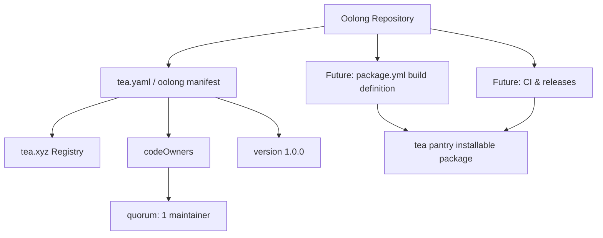

<p align="center">
  
</p>

<p align="center">
  
  
  
  
</p>

> **Developed by [Arslan Malik](https://github.com/arsalanmaalik461)**
> 📱 WhatsApp: [+92 300 8987448](https://wa.me/923008987448) · 🌐 Website: [arslanmalik.tech](https://arslanmalik.tech)

---

## 🌟 Executive Overview

**Oolong** is a registered package entry on the [tea.xyz](https://tea.xyz) decentralized package registry. It currently ships the standard tea package manifest (`tea.yaml`, mirrored as the `oolong` file) at version **1.0.0**, declaring code ownership and a quorum of 1 — the canonical footprint for a package identifier on the tea network.

This repository is in its earliest starter stage: no package definition, source code, or binaries have been committed yet. It is a clean, honest foundation ready to grow into a full tea pantry package. If you are looking to contribute or adopt this package name, the README below walks through what the manifest declares today and how to build on it.

---

## 📑 Table of Contents

- [✨ Key Features & Highlights](#-key-features--highlights)
- [🖥️ Feature Showcase](#️-feature-showcase)
- [🏗️ System Architecture](#️-system-architecture)
- [🚀 Quickstart & Installation Guide](#-quickstart--installation-guide)
- [📂 Project Structure](#-project-structure)
- [🛡️ Security & Notes](#️-security--notes)

---

## ✨ Key Features & Highlights

| Feature | Description |
| :--- | :--- |
| 📦 tea.xyz Package Manifest | Standard `tea.yaml` descriptor (v1.0.0) registering the Oolong package identity |
| 👤 Declared Code Ownership | `codeOwners` field lists the maintainer's address for registry governance |
| 🤝 Quorum Set | `quorum: 1` — single-maintainer authority over package updates |
| 🌱 Clean Starter Base | No legacy code; a blank slate for a full pantry package definition |
| 🔗 Mirrored Descriptor | Both `oolong` and `tea.yaml` carry the manifest for registry compatibility |

---

## 🖥️ Feature Showcase

### 1. Standard tea Manifest

> A minimal, spec-compliant tea.xyz descriptor — the identity card of the package.

- `version: 1.0.0` — the declared release version on the registry
- `codeOwners` — maintainer address: `0x3481f3648A148ee91A332298514b7cFF52c08289`
- `quorum: 1` — one owner signature suffices for package changes

### 2. Starter-Stage Repository

> Honest about what it is: the entry exists, the package content is yet to come.

- Ready for a full `package.yml` build definition (build steps, dependencies, platforms)
- Ready for CI workflows and release automation
- Naming, branding, and governance hooks can be added without restructuring

---

## 🏗️ System Architecture



---

## 🚀 Quickstart & Installation Guide

### Prerequisites

- [tea](https://tea.xyz) CLI installed (`sh <(curl https://tea.xyz)` on macOS/Linux)
- Git

### Step-by-Step Installation

```bash
# 1. Clone the registry entry
git clone https://github.com/arsalanmaalik461/Oolong.git
cd Oolong

# 2. Inspect the manifest
cat tea.yaml

# 3. (When a package definition is added) install via tea
# tea +github.com/arsalanmaalik461/Oolong
```

---

## 📂 Project Structure

```
Oolong/
├── README.md               # This file
├── docs/
│   └── assets/
│       └── banner.svg      # Project banner
├── oolong                  # tea manifest (mirror)
└── tea.yaml                # tea.xyz package manifest (v1.0.0)
```

---

## 🛡️ Security & Notes

- The `codeOwners` address in `tea.yaml` is the authoritative on-chain identity — verify it matches before trusting any published build of this package.
- `quorum: 1` means a single maintainer signature can update the package; this is standard for starter entries but review before production use.
- No binaries or build scripts are shipped in this repo today — there is nothing to execute, so supply-chain risk is currently zero.
- A license is not yet declared; treat usage rights as TBD until a `LICENSE` file is added.

---

<p align="center">
  <sub>Developed with ❤️ by <a href="https://github.com/arsalanmaalik461">Arslan Malik</a> · 📱 <a href="https://wa.me/923008987448">WhatsApp: +92 300 8987448</a> · 🌐 <a href="https://arslanmalik.tech">arslanmalik.tech</a></sub>
</p>
